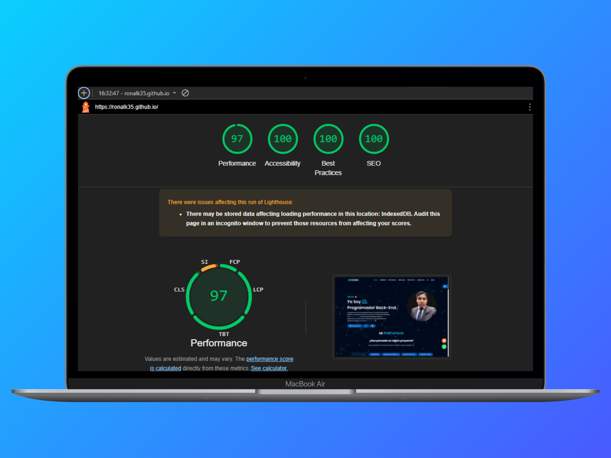

# Portafolio Ronald Urbano Chávez. 2.0

## Descripción del Proyecto

- **Nombre**: `portafolio-ronald-2.0`
- **Versión**: `2.0.0`
- **Descripción**: Nueva versión del portafolio de Ronald Urbano Chávez.
- **Autor**: Ronald Urbano Chávez

---

## Tecnologías Utilizadas

- **HTML, CSS y JavaScript**: Para la estructura, estilos y funcionalidades del sitio.
- **Firebase Console**: Implementado para el contador de visitas.
- **Visual Studio Code**: Utilizado como entorno de desarrollo con la extensión *Live Server* para previsualización en tiempo real.
- **Librerías de Animación**: Para darle efectos a la página principal.

---

## Instalación

Clona el repositorio y abre el proyecto en Visual Studio Code:

```bash
git clone https://github.com/Ronalk35/ronalk35.github.io.git
```

---

## Uso

Para comenzar a desarrollar el proyecto, utiliza la extensión *Live Server* en Visual Studio Code y ejecuta el archivo `index.html`.

---

## Contenido del Portafolio

El portafolio muestra proyectos en las siguientes áreas:

| Área                  | Descripción                                              |
| --------------------- | -------------------------------------------------------- |
| **Diseño Web**        | Proyectos de desarrollo y maquetación web.               |
| **Análisis de Datos** | Visualizaciones y dashboards interactivos.               |
| **Data Engineering**  | Soluciones de ingeniería de datos.                       |
| **WordPress**         | Desarrollo y personalización de sitios en WordPress.     |
| **SQL Server**        | Proyectos de gestión y administración de bases de datos. |

---

## Contribuidores

| Usuario              | Perfil de GitHub                                 | Foto |
| -------------------- | ------------------------------------------------ | ---- |
| Ronald Urbano Chávez | [@Ronalk35](https://github.com/Ronalk35) |      | 

---

## Próximas Actualizaciones

- Mejoras en el diseño responsivo.
- Integración de nuevas funcionalidades.
- Optimizaciones en el rendimiento del sitio.
- Botón de modo claro a modo oscuro.

---

## Vista Previa

- Diseño del Portafolio:


---

## Puntuación

- LightHouse:



---

## Paleta de Colores - Portafolio Ronald 2.0

## Tema Claro (Light Mode)

### Colores Primarios

| Rol         | Color       | Descripción                                                  | Muestra                          |
|-------------|-------------|--------------------------------------------------------------|----------------------------------|
| Principal   | `#fef6e4`   | Beige claro para fondos y áreas principales                  | <div style="width:30px;height:20px;background:#fef6e4;"></div> |
| Secundario  | `#8bd3dd`   | Turquesa suave para acentos y elementos interactivos         | <div style="width:30px;height:20px;background:#8bd3dd;"></div> |
| Terciario   | `#0056b3`   | Azul oscuro para botones y llamados a la acción              | <div style="width:30px;height:20px;background:#0056b3;"></div> |

### Gradientes

| Nombre        | Código                                                                                   | Muestra |
|---------------|-------------------------------------------------------------------------------------------|---------|
| Gradiente 1    | `linear-gradient(120deg, #0078ff 0%, #00c896 100%)` + `box-shadow: 0 0 25px rgba(0, 123, 255, 0.8)` | *(ver en CSS)* |

---

## Tema Oscuro (Dark Mode)

### Colores Primarios

| Rol              | Color       | Descripción                                             | Muestra                          |
|------------------|-------------|---------------------------------------------------------|----------------------------------|
| Fondo Principal  | `#000a1f`   | Azul marino muy oscuro para el fondo general            | <div style="width:30px;height:20px;background:#000a1f;"></div> |
| Texto Principal  | `#ffffff`   | Blanco puro para texto principal                        | <div style="width:30px;height:20px;background:#ffffff;border:1px solid #ccc;"></div> |
| Texto Secundario | `#00bfff`   | Azul celeste para textos secundarios                    | <div style="width:30px;height:20px;background:#00bfff;"></div> |
| Footer           | `#02102b`   | Azul grisáceo oscuro para el pie de página              | <div style="width:30px;height:20px;background:#02102b;"></div> |

### Gradientes

| Nombre        | Código                                                                                   | Muestra |
|---------------|-------------------------------------------------------------------------------------------|---------|
| Gradiente 1    | `linear-gradient(120deg, #3a9fff 0%, #26e0b0 100%)` + `box-shadow: 0 0 25px rgba(0, 123, 255, 0.8)` | *(ver en CSS)* |

